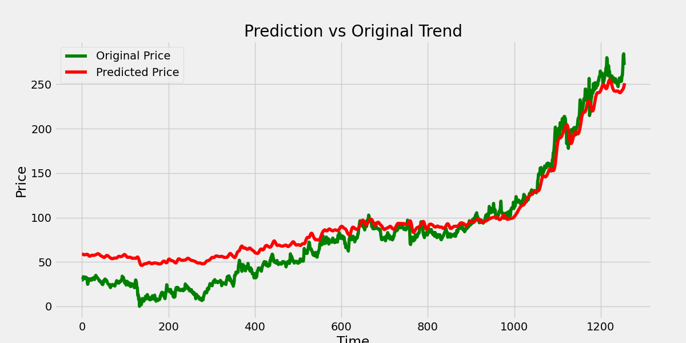

# Stock Price Prediction App

Cette application Streamlit prédit le prix de clôture d'une action à l'aide d'un modèle LSTM entraîné sur les données POWERGRID.

## Fonctionnalités
- Prédiction du prix de clôture à partir des 100 derniers prix.
- Interface simple et interactive.

## Démarrage rapide

1. **Cloner le dépôt**
```bash
git clone <votre-url-github>
cd stock_price_prediction
```
2. **Installer les dépendances**
```bash
pip install -r requirements.txt
```


## Exemple d'interface



## Fichiers importants
- `POWERGRID.csv` : Données historiques
- `stock_dl_model.h5` : Modèle entraîné
